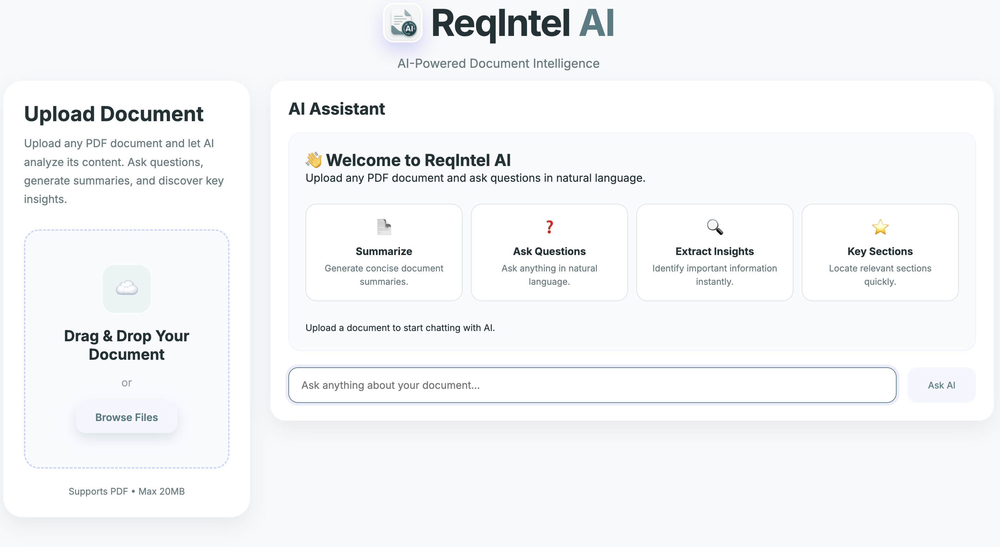
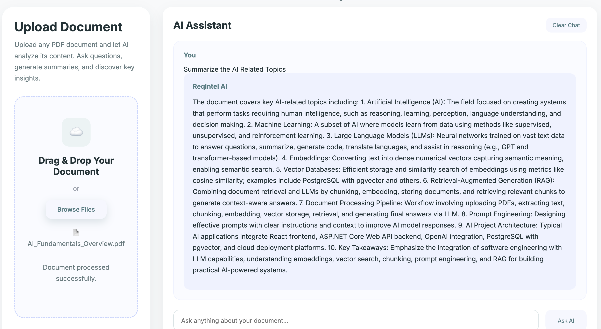

# 🤖 ReqIntel AI

<div align="center">

### AI-Powered Document Intelligence using Retrieval-Augmented Generation (RAG)

Upload any PDF document, automatically index its contents using vector embeddings, and interact with it through natural language. ReqIntel AI retrieves the most relevant information from your documents and generates accurate, context-aware answers using Retrieval-Augmented Generation (RAG).

Built with **ASP.NET Core**, **React**, **PostgreSQL + pgvector**, and **OpenAI**.

---

🌐 **Frontend:** https://reqintel-ai.vercel.app

⚡ **Backend API:** https://reqintel-ai.onrender.com

</div>

---

# 📸 Application Preview

### Upload Document



---

### Ask Questions in Natural Language



---

# 📖 Overview

ReqIntel AI is an AI-powered document intelligence platform that enables users to upload PDF documents and interact with them through natural language conversations.

Instead of relying on traditional keyword-based search, the application leverages Retrieval-Augmented Generation (RAG) and semantic vector search to understand the meaning behind a user's question and retrieve the most relevant information from the uploaded document.

When a document is uploaded, the application automatically extracts its text, divides the content into manageable chunks, generates vector embeddings for each chunk using OpenAI, and stores them in a PostgreSQL database enhanced with the pgvector extension.

When a user submits a question, the application generates an embedding for the query, performs semantic similarity search across the indexed document, retrieves the most relevant sections, and provides an AI-generated response grounded in the retrieved context.

Whether the uploaded document is a software requirement specification, technical documentation, research paper, user manual, policy document, contract, standard operating procedure (SOP), business report, or any other text-based PDF, ReqIntel AI enables users to quickly discover information and obtain accurate answers without manually searching through hundreds of pages.

By combining vector databases, semantic search, and Large Language Models, ReqIntel AI transforms static documents into an intelligent, searchable knowledge base capable of understanding context rather than simply matching keywords.


# 🏗️ System Architecture

```
                    ┌──────────────────────────┐
                    │      React Frontend      │
                    │         (Vite)           │
                    └─────────────┬────────────┘
                                  │
                           HTTP REST APIs
                                  │
                                  ▼
                 ┌────────────────────────────────┐
                 │      ASP.NET Core Web API      │
                 ├────────────────────────────────┤
                 │                                │
                 │  • PDF Processing              │
                 │  • Text Extraction             │
                 │  • Text Chunking               │
                 │  • Embedding Generation        │
                 │  • Vector Similarity Search    │
                 │  • AI Chat Service             │
                 │                                │
                 └──────────────┬─────────────────┘
                                │
               ┌────────────────┴──────────────┐
               │                               │
               ▼                               ▼
      PostgreSQL + pgvector            OpenAI API
      Vector Database                  GPT & Embeddings
               │                               │
               └──────────────┬────────────────┘
                              │
                              ▼
                  AI-Powered Contextual Response
```

---

# 🔄 RAG Workflow

```
        User Uploads PDF
               │
               ▼
     Extract Text from PDF
               │
               ▼
        Split into Chunks
               │
               ▼
 Generate OpenAI Embeddings
               │
               ▼
 Store Embeddings in PostgreSQL
          using pgvector
               │
               ▼
      User Asks a Question
               │
               ▼
 Generate Query Embedding
               │
               ▼
 Vector Similarity Search
               │
               ▼
 Retrieve Relevant Chunks
               │
               ▼
 Send Context + Question
       to OpenAI GPT
               │
               ▼
 AI Generates Context-Aware Answer
```

# 📖 How It Works

## Step 1 — Upload a Document

Users can upload any text-based PDF document through the web application. The system is designed to work with a wide variety of document types, including software requirement specifications, technical documentation, user manuals, research papers, contracts, business reports, policies, standard operating procedures (SOPs), and other knowledge-rich documents.

---

## Step 2 — Text Extraction

Once uploaded, the backend extracts all readable text from the PDF using the PdfPig library while preserving the document content for further processing.

---

## Step 3 — Intelligent Chunking

Large documents are divided into smaller logical chunks.

Chunking improves retrieval quality by ensuring that each embedding represents a focused section of the document rather than the entire document.

---

## Step 4 — Embedding Generation

Each text chunk is converted into a high-dimensional vector embedding using the OpenAI Embedding Model.

Unlike keyword indexing, embeddings capture the semantic meaning of the content, enabling intelligent document search.

---

## Step 5 — Vector Storage

Each chunk, together with its generated embedding, is stored inside PostgreSQL using the pgvector extension.

Stored information includes:

• Document Name

• Chunk Index

• Chunk Content

• Vector Embedding

• Created Timestamp

---

## Step 6 — User Question

The user asks a question in natural language through the chat interface.

For example:

"What are the functional requirements?"

"What are the security recommendations?"

"Summarize the deployment architecture."

"What technologies are mentioned?"

---

## Step 7 — Semantic Retrieval

The user's question is converted into another embedding.

Using vector similarity search, PostgreSQL retrieves the document chunks that are semantically closest to the question.

This allows the application to understand intent instead of relying solely on keyword matching.

---

## Step 8 — Retrieval-Augmented Generation

The retrieved document context, along with the user's question, is sent to the OpenAI GPT model.

Instead of answering purely from its training knowledge, the model generates responses grounded in the uploaded document, resulting in accurate, context-aware answers while significantly reducing hallucinations.

# 🚀 Features

- 📄 Upload any text-based PDF document
- 📑 Automatic PDF text extraction
- ✂️ Intelligent document chunking
- 🧠 OpenAI embedding generation
- 🗄️ PostgreSQL + pgvector vector database
- 🔍 Semantic vector similarity search
- 🤖 Retrieval-Augmented Generation (RAG)
- 💬 Context-aware AI question answering
- ⚡ Fast document indexing
- ☁️ Cloud deployment using Vercel, Render, and Neon
- 🌐 Modern React user interface
- 🏗️ Enterprise-ready ASP.NET Core Web API
